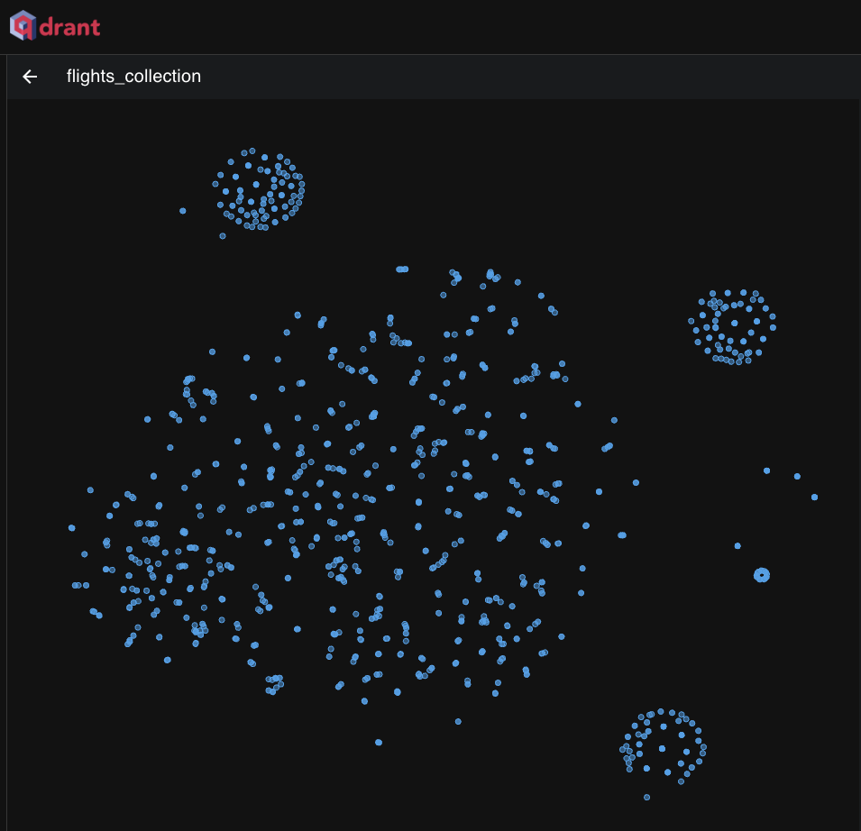

# 多智能体RAG客服系统


## 项目简介

本项目实现了一个基于多智能体（Multi-Agent）和检索增强生成（Retrieval-Augmented Generation, RAG）技术的客户支持系统。它利用 Python、LangChain 和 LangGraph 构建了一个能够处理各种旅行相关查询的对话式 AI，包括航班预订、租车、酒店预订和行程推荐。还有对接了woocommerce商城进行商品查询，文章查询，表单提交，订单查询等商城功能。
本项目fork自 https://github.com/ro-anderson/multi-agent-rag-customer-support ，一个基础的框架。

本项目在原基础上进行了重大功能扩展，新增了安全护栏机制（越狱防护和相关性检查）和基于 GoHumanLoop 的人工审核流程，极大地提升了系统的安全性和可控性。

### 系统功能演示


### 多智能体RAG系统流程图


## 架构概览

系统采用多智能体架构，使用 LangGraph 实现为状态图。以下是主要组件说明：

1.  **主助手 (Primary Assistant)**: 用户查询的入口点。它根据用户需求将对话路由到专门的助手。
2.  **专业助手 (Specialized Assistants)**:
    *   **航班预订助手**: 处理航班相关的查询和预订。
    *   **租车助手**: 管理租车请求。
    *   **酒店预订助手**: 处理酒店预订查询。
    *   **行程推荐助手**: 处理旅行和活动推荐。
    *   **WooCommerce助手**: 处理电商产品和订单查询。
    *   **表单提交助手**: 处理用户表单提交。
    *   **博客搜索助手**: 处理博客文章搜索。
3.  **工具节点 (Tool Nodes)**: 每个助手都可以访问 *```安全```* 和 *```敏感```* 工具。安全工具无需用户确认即可使用，而敏感工具在执行前需要用户确认。
4.  **路由逻辑 (Routing Logic)**: 系统使用 *```条件边```* 根据当前状态和用户输入在助手和 *```工具节点```* 之间路由对话。
5.  **用户确认 (User Confirmation)**: 对于敏感操作，系统会暂停并请求用户确认后再继续。
6.  **内存和状态管理 (Memory and State Management)**: 系统维护对话状态，并使用 *```内存检查点```* 保存进度。
7.  **安全与确认机制 (Security and Confirmation Mechanisms)**:
    *   **敏感操作确认**: 用户必须确认所有可能修改数据的操作。
    *   **安全护栏**: 在处理用户输入前，系统会通过AI代理进行越狱防护和相关性检查。
    *   **人工审核 (GoHumanLoop)**: 敏感操作在用户确认后，还需通过 GoHumanLoop 框架发送给管理员进行最终审核（例如通过飞书通知）。

这种架构允许以灵活和模块化的方式处理各种客户支持场景，同时为敏感操作内置了多重安全措施。

## 项目可观测性

为了确保有效的监控和调试能力，项目集成了 LangSmith 以增强可观测性。LangSmith 有助于跟踪请求的生命周期，包括工具使用、代理响应和错误，使开发人员能够了解多智能体系统随时间的性能表现。


## 本地运行环境要求

*   Python 3.12+
*   [Poetry](https://python-poetry.org/docs/#installation)
*   Docker 和 Docker Compose
*   OpenAI API Key
*   LangSmith API Key (可选，用于追踪)

## 如何运行？

### 本地环境设置

1. 克隆代码仓库并导航到项目目录。

2. 从 `.dev.env` 创建 `.env` 文件:
```bash
cp .dev.env .env
```

3. 编辑 `.env` 文件并填入所需值:

```bash
OPENAI_API_KEY="your_openai_api_key"
LANGCHAIN_API_KEY="your_langsmith_api_key" # 可选
# 如需配置 GoHumanLoop，请添加:
# GOHUMANLOOP_API_KEY="your_gohumanloop_api_key"
# 如需配置 QDRANT，请添加:
# QDRANT_URL="your_QDRANT_URL"
# woocommerce接口相关
# WOOCOMMERCE_API_URL="your_WOOCOMMERCE_API_URL"
# WOOCOMMERCE_API_KEY="your_WOOCOMMERCE_API_KEY"
# WOOCOMMERCE_API_SECRET="your_WOOCOMMERCE_API_SECRET"

```

4. 安装依赖:

```bash
poetry install
```

5. 启动 Qdrant 向量数据库（可选，或者直接使用云qdrant):

```bash
docker compose up qdrant -d
```

   你可以通过以下地址访问 Qdrant UI: http://localhost:6333/dashboard#

6. 生成向量嵌入:

```bash
poetry run python vectorizer/app/main.py
```

7. 运行客户支持聊天系统:

命令行版本：
```bash
poetry run python ./customer_support_chat/app/main.py
```
web界面版本：
```bash
poetry run uvicorn web_app.app.main:app --reload --host 0.0.0.0 --port 8000
```

## 项目结构

本项目包含两个主要服务:

1.  **Vectorizer**: 为知识库生成向量嵌入。
2.  **Customer Support Chat**: 主对话式 AI 系统。
3.  **faq_documents**: 知识库文档，用于生成向量嵌入。
4.  **web_app**: web界面版本，用于与用户交互。
5.  **graphs**: 包含系统图的目录，用于可视化系统架构。
6.  **faq_extension**: 新增的知识库文档目录，用于独立的生成向量嵌入。


Customer Support Chat 服务依赖于 Vectorizer 生成的向量数据库。

## 数据源与向量数据库

本项目使用两个主要数据源:

1.  **旅行数据库**:
    一个来自 LangGraph 的旅行数据库基准。这个 SQLite 数据库存储了航班、预订、乘客和其他旅行相关数据。

    

    数据来源: [LangGraph Travel DB Benchmark](https://storage.googleapis.com/benchmarks-artifacts/travel-db)

2.  **Qdrant**:
    一个用于存储和查询旅行数据库向量嵌入的向量数据库。

    

## 服务代码概览

*   [vectorizer](./vectorizer/README.md)
*   [customer_support_chat](./customer_support_chat/README.md)
*   [web_app](./web_app/README.md)
*   [graphs](./graphs/README.md)
*   [faq_extension](./faq_extension/README.md)

## 详细功能和技术文档

系统功能说明文档-技术实现版.md ,  系统功能说明文档.md , 

## 系统未来改进方向

为了继续改进多智能体RAG系统，以下是一些直接相关的增强方向：

**工具优化:**
利用先进的 RAG 技术改进现有工具的潜力巨大：
*   在现有的搜索工具 (`search_flights`, `search_hotels`, `search_car_rentals` 等) 中实现 [```自适应 RAG```](https://langchain-ai.github.io/langgraph/tutorials/rag/langgraph_adaptive_rag/) 方法，通过集成更精细的过滤来提高从向量数据库 (VecDB) 检索的准确性。
*   当 VecDB 结果不足时，对网络搜索工具应用 [```纠正性 RAG```](https://arxiv.org/abs/2401.15884)，确保回退搜索更相关且高效。
*   利用 [```自我 RAG```](https://langchain-ai.github.io/langgraph/tutorials/rag/langgraph_self_rag_local/) 来评估生成的答案是否基于检索到的数据（来自 VecDB 或网络搜索）。如果不是，代理可以在响应前请求更准确或额外的信息，确保最终输出的数据完整性。

**图架构优化:**
*   **图优化**: 通过在 `graph.py` 中为不同代理添加更详细的条件路径来增强逻辑，确保基于用户查询和检索文档做出更好的决策。

**集成内存:**
*   实现一个缓存数据库来存储用户状态和对话历史，允许代理参考过去的交互以提供更个性化和情境感知的响应。目前是直接保存个人用户数据在独立的json(user_data文件夹里面)


## 介绍文章：

大家好，今天想跟大家分享一个我最近在研究和改进的 AI 项目：一个基于多智能体（Multi-Agent）和 RAG 技术的智能客服系统。这个项目原本是用来处理旅行相关问题的，比如查航班、订酒店之类的。但我觉得它有更大的潜力，所以花了一些时间给它“升级”了一下，让它变得更强大、也更安全。

---

### **一、 这个项目是做什么的？它解决了什么问题？**

简单来说，这个项目是一个能和你“聊天”的 AI 客服。你问它问题，它不是简单地从网上搜一段文字粘贴给你，而是像一个真正的客服专员一样，理解你的需求，调用不同的工具（比如查数据库、查政策、甚至帮你下单），然后给你一个准确、完整的回答。

**它解决的核心问题**是：**如何让 AI 客服变得更“聪明”、更“专业”、更“安全”？**

1.  **“聪明”**：很多 AI 聊天机器人，问简单问题还行，一旦问题复杂一点，比如“我想把后天的航班改到大后天，然后顺便看看目的地附近有什么推荐的酒店？”，它就容易懵圈或者给出不相关的回答。这个项目通过“多智能体”架构，让不同的“专家”（助手）各司其职。一个专门管航班，一个专门管酒店，一个专门管租车……主助手负责统筹，把复杂问题拆解，派给对应的“专家”去处理，最后再整合答案。这样就能很好地处理复杂的、需要跨领域知识的问题。

2.  **“专业”**：为了让 AI 的回答有根有据，不是凭空捏造，项目用了 **RAG（检索增强生成）** 技术。它会先去一个专门的“知识库”（这里是一个向量数据库）里查找和你问题最相关的信息，然后再基于这些信息来生成回答。这就像给 AI 配了一个“外挂”的、随时可以查阅的“工作手册”，确保它的回答是基于真实数据的，而不是瞎编。

3.  **“安全”**：这是我觉得这次改进最重要的部分。任何涉及到“真金白银”或“个人隐私”的操作，比如“取消我的机票”、“修改我的酒店订单”，都是非常敏感的。如果这些操作没有足够的保护，万一被恶意利用或者 AI 误解了用户意图，后果不堪设想。原始项目已经有了一层“用户确认”保护，但我觉得还不够。

---

### **二、 原始项目有什么不足？为什么需要改进？**

原始项目已经很棒了，但它在“安全”方面还有提升空间，主要有两点：

1.  **缺乏对“坏问题”的过滤**：它没有能力判断用户输入的问题是否是恶意的“越狱”尝试（比如试图让 AI 忽略所有规则，或者探查它的系统提示词），或者是不是完全不相关的“乱入”（比如问“怎么做红烧肉”）。这些无效的输入会干扰系统，降低效率，甚至可能带来风险。
2.  **人工审核环节缺失**：虽然用户需要确认敏感操作，但对于企业级应用来说，仅靠用户确认是不够的。很多情况下，特别是涉及高价值操作时，需要有一个“管理员”进行最终的审核和批准，才能确保万无一失。

---

### **三、 我是怎么改进的？用了什么方法？**

针对以上两个“安全”方面的不足，我主要做了两方面的改进：

1.  **加装“安全护栏” (Security Guardrails)**：
    *   **越狱防护 (Jailbreak Guardrail)**：在用户提问后、主助手处理前，我增加了一个专门的 AI “安全检查员”。这个“检查员”会快速分析用户的最新一句话，判断是否有越狱或攻击的企图。如果有，系统会直接拦截，并礼貌地告诉用户“这个问题我无法回答”。
    *   **相关性检查 (Relevance Guardrail)**：这个“检查员”还会判断用户的问题是否和我们的客服系统“业务范围”相关。比如，问航班、酒店是相关的，问“怎么做菜”就是不相关的。对于不相关的问题，系统会记录下来（或者给出提示），但不会让它干扰正常的客服流程。

2.  **引入“人工审核” (GoHumanLoop)**：
    *   对于所有标记为“敏感”的操作（如取消机票、修改订单），在用户点击“确认”之后，系统并不会立刻执行。它会通过一个叫 **GoHumanLoop** 的框架，自动将这个操作请求发送给后台的管理员（比如通过飞书）。
    *   管理员会收到一条清晰的通知，上面写着用户要做什么操作。管理员需要判断这个操作是否合理，然后点击“批准”或“拒绝”。
    *   **只有在管理员批准后，操作才会真正执行。** 这就形成了一个“用户确认 + 管理员审核”的双重保险，极大地提升了系统的安全性。

通过这两套机制，系统就像有了一个“智能门卫”（安全护栏）和一个“最终审批官”（人工审核），从入口和出口两个环节牢牢把关，确保系统的安全和稳定。

---

### **四、 这个项目有什么价值？我们能从中学到什么？**

这个项目的价值在于它提供了一套**构建安全、可靠、专业的企业级 AI 客服系统**的完整思路和实践方法。

**对开发者来说**：
*   它是一个很好的 **LangGraph** 和 **LangChain** 学习案例，展示了如何用代码构建复杂的多智能体协作流程。
*   它提供了一套可以复用的**安全机制模板**（安全护栏 + 人工审核），可以应用到其他类似的 AI 应用中。
*   它整合了 **RAG、工具调用 (Function Calling)、状态管理、工作流编排** 等多种关键技术，是一个很好的综合实践项目。

**对企业或产品经理来说**：
*   它清晰地展示了如何在追求 AI 能力的同时，**不以牺牲安全性为代价**。
*   “多智能体”架构的思想可以应用到各种需要复杂决策和跨领域协作的业务场景中。
*   “人工审核”作为最后一道防线，在关键业务中是必不可少的，这个项目提供了如何将其自动化、流程化的参考。

---

### **五、 如果你对这个项目感兴趣，建议你怎么做？**

1.  **动手试试**：代码我都放在 GitHub 上了。如果你是开发者，强烈建议你 clone 下来跑一跑。代码结构清晰，文档也比较全（我自己刚更新过），跟着 `README.md` 的步骤，应该能顺利运行起来。
2.  **理解思路**：不一定非得完全照搬我的代码，但里面的“多智能体”、“RAG”、“安全护栏”、“人工审核”的设计思路是非常值得借鉴的。理解了这些，你就能在自己的项目中灵活运用。
3.  **思考改进**：这个项目还有很多可以优化的地方，比如我 README 里提到的“自适应 RAG”、“内存集成”等等。把它当作一个起点，去思考如何让它变得更强大。

总的来说，这个项目不只是一个“能聊天”的 AI，它更是一个展示如何构建一个**既强大又可靠**的智能系统的范例。希望我的分享能给你带来一些启发！