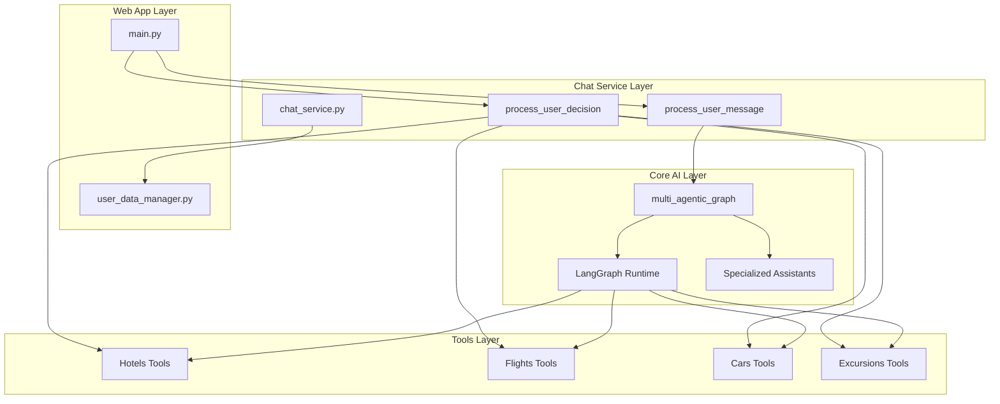
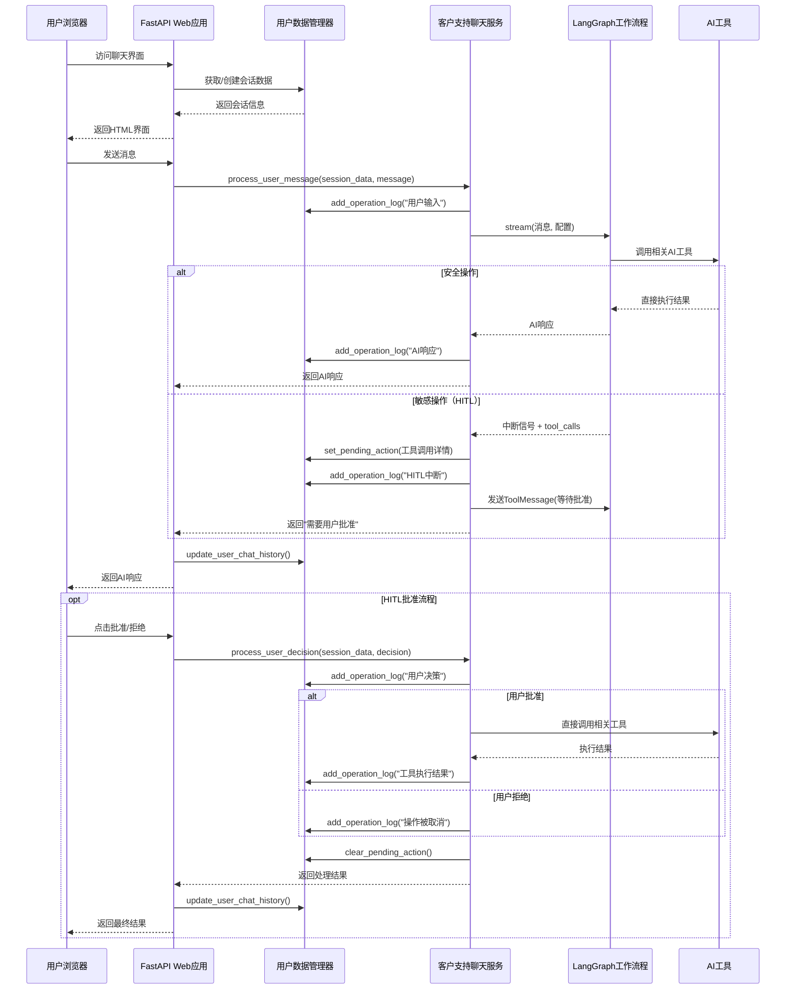

# Web App Module 深度分析文档

## 概述

`web_app` 模块是多智能体 RAG 客户支持系统的 Web 前端接口，提供了一个基于 FastAPI 的现代化 Web 应用程序，使用户能够通过浏览器与多智能体客户支持系统进行交互。该模块实现了完整的会话管理、实时聊天界面、人工在回路(HITL)批准流程以及操作日志功能。

## 项目结构分析

```
web_app/
├── app/
│   ├── core/
│   │   ├── __init__.py                 # 包初始化文件
│   │   └── user_data_manager.py        # 用户数据管理核心模块
│   ├── templates/
│   │   └── chat.html                   # 聊天界面HTML模板
│   ├── __init__.py                     # 应用包初始化
│   └── main.py                         # FastAPI应用主入口
├── user_data/                          # 用户会话数据存储目录
│   ├── *.json                          # 各用户会话数据文件
│   └── test_session.json               # 测试会话数据示例
├── README.md                           # 模块说明文档
└── pyproject.toml                      # Python项目配置文件
```

## 核心组件详细分析

### 1. 主应用程序 (main.py)

#### 1.1 应用架构
- **框架**: FastAPI (现代、高性能的Python Web框架)
- **模板引擎**: Jinja2 (用于渲染HTML模板)
- **会话管理**: Cookie-based session management
- **数据持久化**: JSON文件存储系统

#### 1.2 核心功能模块

**依赖管理**:
```python
# 动态路径添加，确保能够访问customer_support_chat模块
sys.path.append(os.path.join(os.path.dirname(__file__), "..", ".."))
from customer_support_chat.app.services.chat_service import process_user_message
```

**会话数据结构**:
```python
def get_session_data(request: Request):
    """获取或创建当前用户的会话数据"""
    session_id = request.cookies.get("session_id")
    if not session_id:
        session_id = str(uuid.uuid4())  # 生成唯一会话ID
    
    session_data = get_user_session(session_id)
    
    # 确保配置信息存在
    if "config" not in session_data:
        session_data["config"] = {
            "thread_id": session_id,        # LangGraph线程ID
            "passenger_id": "5102 899977"   # 默认乘客ID
        }
```

#### 1.3 API端点分析

**主要端点**:

1. **GET /** - 聊天界面
   - 返回聊天界面HTML页面
   - 设置会话Cookie
   - 加载历史聊天记录

2. **POST /chat** - 消息处理
   - 接收用户消息
   - 通过多智能体系统处理
   - 更新聊天历史
   - 返回AI响应

3. **GET /pending-action** - 检查待处理操作
   - 检查是否有需要用户批准的操作
   - 支持HITL工作流程

4. **POST /approve-action** - 批准操作
   - 处理用户批准决定
   - 继续执行被暂停的工作流程

5. **POST /reject-action** - 拒绝操作
   - 处理用户拒绝决定
   - 终止当前操作流程

6. **GET /operation-log** - 操作日志
   - 获取会话操作日志
   - 支持限制返回条目数量

### 2. 用户数据管理器 (user_data_manager.py)

#### 2.1 数据存储设计
- **存储方式**: 基于文件系统的JSON存储
- **文件位置**: `./user_data/user_sessions.json`
- **数据隔离**: 每个会话ID对应独立的数据结构

#### 2.2 数据结构设计
```json
{
  "session_id": {
    "session_id": "唯一会话标识符",
    "chat_history": [
      {
        "timestamp": "ISO格式时间戳",
        "user_message": "用户消息内容",
        "ai_response": "AI响应内容"
      }
    ],
    "pending_action": "待处理操作详情或null",
    "user_decision": "用户决定或null",
    "operation_log": [
      {
        "timestamp": "操作时间戳",
        "title": "操作标题",
        "content": "操作内容",
        "type": "操作类型"
      }
    ],
    "created_at": "会话创建时间"
  }
}
```

#### 2.3 核心功能函数

**会话管理**:
- `get_user_session(session_id)`: 获取用户会话，不存在则创建
- `update_user_chat_history(session_id, user_message, ai_response)`: 更新聊天历史

**HITL支持**:
- `set_pending_action(session_id, action_details)`: 设置待批准操作
- `get_pending_action(session_id)`: 获取待批准操作
- `clear_pending_action(session_id)`: 清除待批准操作
- `set_user_decision(session_id, decision)`: 设置用户决定
- `get_user_decision(session_id)`: 获取用户决定

**操作日志**:
- `add_operation_log(session_id, log_entry)`: 添加操作日志条目
- `get_operation_log(session_id, limit=50)`: 获取操作日志
- `clear_operation_log(session_id)`: 清除操作日志

### 3. 前端界面 (chat.html)

#### 3.1 界面设计
- **布局**: 双栏布局（聊天区域 + 操作日志）
- **响应式**: 适配不同屏幕尺寸
- **交互性**: 实时消息发送和接收
- **可视化**: 区分用户消息和AI响应的样式

#### 3.2 核心JavaScript功能

**消息处理**:
```javascript
async function sendMessage() {
    const message = userInput.value.trim();
    if (!message) return;
    
    // 禁用输入并显示加载指示器
    userInput.disabled = true;
    sendBtn.disabled = true;
    loadingIndicator.style.display = 'block';
    
    try {
        addMessage('user', message);
        userInput.value = '';
        
        const response = await fetch('/chat', {
            method: 'POST',
            headers: { 'Content-Type': 'application/json' },
            body: JSON.stringify({ message: message })
        });
        
        const data = await response.json();
        
        if (data.error) {
            addMessage('assistant', `Error: ${data.error}`);
        } else {
            addMessage('assistant', data.response);
        }
    } catch (error) {
        addMessage('assistant', 'An unexpected error occurred. Please try again later.');
        console.error('Error:', error);
    } finally {
        // 重新启用输入并隐藏加载指示器
        userInput.disabled = false;
        sendBtn.disabled = false;
        loadingIndicator.style.display = 'none';
        userInput.focus();
    }
}
```

**HITL处理**:
```javascript
async function checkPendingAction() {
    try {
        const response = await fetch('/pending-action');
        const data = await response.json();
        
        if (data.pending_action) {
            // 显示待批准操作模态框
            let detailsHTML = '<h4>Tool Calls:</h4><ul>';
            data.pending_action.tool_calls.forEach(toolCall => {
                detailsHTML += `<li><strong>${toolCall.name}</strong>: ${JSON.stringify(toolCall.args)}</li>`;
            });
            detailsHTML += '</ul>';
            pendingActionDetails.innerHTML = detailsHTML;
            pendingActionModal.style.display = 'block';
        }
    } catch (error) {
        console.error('Error checking pending action:', error);
    }
}
```

**操作日志显示**:
```javascript
function displayOperationLog(logEntries) {
    if (!logEntries || logEntries.length === 0) {
        operationLogContent.innerHTML = '<div class="log-entry">No operation log entries</div>';
        return;
    }
    
    let logHTML = '';
    logEntries.forEach(entry => {
        const timestamp = new Date(entry.timestamp).toLocaleTimeString();
        logHTML += `
            <div class="log-entry ${entry.type}">
                <div class="log-title">${entry.title}</div>
                <div class="log-content">${entry.content}</div>
                <div class="log-timestamp">${timestamp}</div>
            </div>
        `;
    });
    
    operationLogContent.innerHTML = logHTML;
}
```

## 系统集成与工作流程

### 1. 与主系统的集成

#### 1.1 Chat Service 模块详细分析

**核心功能模块**: `customer_support_chat.app.services.chat_service`

Chat Service 是 Web App 与多智能体系统之间的核心桥梁，提供了两个主要的异步函数来处理用户消息和决策。

##### 1.1.1 主要依赖和导入
```python
# 主要依赖
from customer_support_chat.app.services.chat_service import process_user_message
from customer_support_chat.app.services.chat_service import process_user_decision

# Chat Service 内部依赖结构
from customer_support_chat.app.graph import multi_agentic_graph
from customer_support_chat.app.core.logger import logger
from langchain_core.messages import ToolMessage, HumanMessage, AIMessage

# Web App 集成依赖（动态导入）
from web_app.app.core.user_data_manager import (
    set_pending_action, get_pending_action, get_user_decision, 
    clear_pending_action, clear_user_decision, add_operation_log
)
```

##### 1.1.2 process_user_message 函数详解

**函数签名**:
```python
async def process_user_message(session_data: Dict[str, Any], user_message: str) -> str
```

**核心处理流程**:

1. **配置提取和转换**:
```python
# 提取会话配置
config = session_data.get("config", {})
# 转换为LangGraph兼容格式
langgraph_config = {"configurable": config}
```

2. **消息流处理**:
```python
# 通过图形处理用户输入
events = multi_agentic_graph.stream(
    {"messages": [("user", user_message)]}, 
    langgraph_config, 
    stream_mode="values"
)

# 收集和分类消息
for event in events:
    messages = event.get("messages", [])
    for message in messages:
        if isinstance(message, AIMessage):
            # 记录AI响应
            ai_responses.append(message.content)
        elif hasattr(message, 'tool_calls') and message.tool_calls:
            # 记录工具调用
            for tool_call in message.tool_calls:
                add_operation_log(session_data["session_id"], {
                    "type": "tool_call",
                    "title": f"{tool_call['name']} call",
                    "content": f"{tool_call['args']}"
                })
```

3. **中断处理（HITL机制）**:
```python
# 检查是否有中断（需要人工批准的操作）
snapshot = multi_agentic_graph.get_state(langgraph_config)
if snapshot.next:
    # 提取工具调用详情
    last_message = snapshot.values["messages"][-1]
    if last_message and hasattr(last_message, 'tool_calls'):
        # 设置待批准操作
        pending_action = {
            "tool_calls": tool_calls_details,
            "timestamp": asyncio.get_event_loop().time()
        }
        set_pending_action(session_data["session_id"], pending_action)
        
        # 创建工具消息响应以防止错误
        tool_messages = []
        for tool_call in last_message.tool_calls:
            tool_messages.append(
                ToolMessage(
                    tool_call_id=tool_call["id"],
                    content="Action requires user approval. Please wait for user decision."
                )
            )
        
        # 更新图状态
        multi_agentic_graph.update_state(
            langgraph_config,
            {"messages": tool_messages}
        )
```

4. **操作日志记录**:
```python
# 用户输入日志
add_operation_log(session_data["session_id"], {
    "type": "user_input",
    "title": "User Message",
    "content": user_message
})

# AI响应日志
add_operation_log(session_data["session_id"], {
    "type": "ai_response", 
    "title": "AI Response",
    "content": message.content
})

# 工具调用日志
add_operation_log(session_data["session_id"], {
    "type": "tool_call",
    "title": f"{tool_call['name']} call",
    "content": tool_call_details,
    "details": {
        "tool_name": tool_call['name'],
        "tool_call_id": tool_call['id'],
        "parameters": tool_call['args']
    }
})
```

##### 1.1.3 process_user_decision 函数详解

**函数签名**:
```python
async def process_user_decision(session_data: Dict[str, Any], decision: str) -> str
```

**决策处理流程**:

1. **批准操作处理**:
```python
if decision.lower() == "approve":
    # 直接执行工具
    for tool_call in tool_calls:
        tool_name = tool_call["name"]
        tool_args = tool_call["args"]
        
        # 动态导入和执行相应工具
        if tool_name == "update_hotel":
            from customer_support_chat.app.services.tools.hotels import update_hotel
            result = update_hotel.invoke(tool_args)
            ai_responses.append(f"Hotel updated successfully: {result}")
        elif tool_name == "book_hotel":
            from customer_support_chat.app.services.tools.hotels import book_hotel
            result = book_hotel.invoke(tool_args)
            ai_responses.append(f"Hotel booked successfully: {result}")
        # ... 其他工具处理
```

2. **拒绝操作处理**:
```python
else:  # reject
    ai_responses.append("Operation cancelled by user.")
    add_operation_log(session_data["session_id"], {
        "type": "system_message",
        "title": "Action Cancelled", 
        "content": "User rejected the sensitive action"
    })
```

3. **状态清理**:
```python
# 清理待处理操作和用户决策
clear_pending_action(session_data["session_id"])
clear_user_decision(session_data["session_id"])
```

##### 1.1.4 错误处理和容错机制

**动态模块可用性检测**:
```python
try:
    from web_app.app.core.user_data_manager import ...
    WEB_APP_AVAILABLE = True
except ImportError as e:
    logger.warning(f"Web app modules not available. HITL functionality will be limited. Error: {e}")
    WEB_APP_AVAILABLE = False
```

**异常处理策略**:
```python
try:
    # 主要处理逻辑
    ...
except Exception as e:
    logger.error(f"An error occurred while processing: {e}")
    # 记录错误日志
    if WEB_APP_AVAILABLE:
        add_operation_log(session_data["session_id"], {
            "type": "error",
            "title": "Processing Error",
            "content": str(e)
        })
    # 返回用户友好的错误消息
    return "An unexpected error occurred. Please try again later."
```

##### 1.1.5 支持的工具类型

Chat Service 当前支持以下敏感工具的HITL处理：
- **酒店工具**: `update_hotel`, `book_hotel`, `cancel_hotel`
- **航班工具**: 类似的增删改操作（可扩展）
- **租车工具**: 类似的增删改操作（可扩展）
- **游览工具**: 类似的增删改操作（可扩展）

#### 1.2 模块依赖关系图


#### 1.3 数据流程分析


### 2. 会话管理机制

#### 2.1 会话生命周期
1. **会话创建**: 用户首次访问时生成UUID作为会话ID
2. **会话维持**: 通过HTTP Cookie保持会话状态
3. **数据持久化**: 实时保存聊天历史和配置到JSON文件
4. **会话恢复**: 用户重新访问时自动加载历史数据

#### 2.2 配置管理
```python
session_data["config"] = {
    "thread_id": session_id,        # LangGraph检查点线程ID
    "passenger_id": "5102 899977"   # 默认乘客ID（可配置）
}
```

### 3. HITL (Human-in-the-Loop) 工作流程

#### 3.1 工作流程设计
1. **检测**: 定期检查是否有待批准的操作
2. **展示**: 通过模态框展示操作详情
3. **决策**: 用户选择批准或拒绝
4. **执行**: 根据用户决策继续或终止操作

#### 3.2 轮询机制
```javascript
// 每5秒检查一次待处理操作
setInterval(checkPendingActionWithRetry, 5000);

// 每10秒获取一次操作日志
setInterval(fetchOperationLogWithRetry, 10000);
```

## 技术特性与优势

### 1. 架构优势
- **模块化设计**: 清晰的功能分离和依赖关系
- **可扩展性**: 易于添加新功能和端点
- **可维护性**: 代码结构清晰，职责分明

### 2. 用户体验
- **实时交互**: 异步消息处理，无需页面刷新
- **状态保持**: 会话数据持久化，支持断线重连
- **错误处理**: 完善的错误提示和重试机制
- **操作透明**: 实时操作日志显示系统行为

### 3. 安全性考虑
- **会话隔离**: 每个用户的数据完全隔离
- **输入验证**: 对用户输入进行适当的验证和清理
- **错误隐藏**: 不向用户暴露敏感的系统错误信息

## 配置与部署

### 1. 依赖要求
```toml
[tool.poetry.dependencies]
python = "^3.12"
fastapi = "^0.112.2"
uvicorn = {version = "^0.30.6", extras = ["standard"]}
jinja2 = "^3.1.4"
python-multipart = "^0.0.9"
httpx = "^0.27.2"
itsdangerous = "^2.2.0"
```

### 2. 启动命令
```bash
# 安装依赖
poetry install

# 启动应用
poetry run uvicorn web_app.app.main:app --reload --host 0.0.0.0 --port 8000
```

### 3. 环境要求
- 确保主项目依赖已安装
- Qdrant服务正在运行
- 相关API密钥已配置

## 性能考虑与优化建议

### 1. 当前性能特点
- **优势**: 
  - 乐观更新提升用户体验
  - 异步处理避免阻塞
  - 轻量级JSON存储

- **潜在瓶颈**:
  - 文件I/O操作在高并发下可能成为瓶颈
  - 轮询机制消耗资源
  - 内存中数据管理可能导致数据丢失

### 2. 优化建议
- **数据库升级**: 考虑迁移到SQLite或PostgreSQL
- **缓存机制**: 实现Redis缓存以减少文件I/O
- **WebSocket**: 替换轮询机制实现真正的实时通信
- **负载均衡**: 支持多实例部署

## 故障排除指南

### 1. 常见问题

**会话数据丢失**:
- 检查`user_data`目录权限
- 验证JSON文件格式是否正确
- 确认磁盘空间充足

**无法连接到聊天服务**:
- 验证`customer_support_chat`模块路径
- 检查相关依赖是否正确安装
- 确认API密钥配置正确

**前端界面错误**:
- 检查浏览器控制台错误信息
- 验证网络连接和API端点可访问性
- 确认会话Cookie设置正确

### 2. 调试建议
- 启用详细日志记录
- 使用浏览器开发者工具监控网络请求
- 检查服务器端错误日志

## 总结

Web App模块是一个设计良好的现代化Web应用程序，成功地将复杂的多智能体AI系统包装成了用户友好的Web界面。该模块的主要优势包括：

1. **完整的功能覆盖**: 从基础聊天到高级HITL工作流程
2. **良好的用户体验**: 实时交互、状态保持、错误处理
3. **清晰的架构设计**: 模块化、可维护、可扩展
4. **实用的管理功能**: 操作日志、会话管理、数据持久化

该模块为整个多智能体RAG客户支持系统提供了一个专业、可靠的Web前端接口，使得复杂的AI功能能够通过简单直观的Web界面为最终用户所使用。